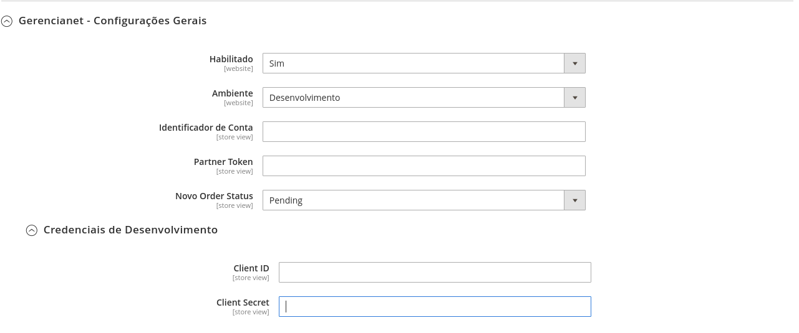
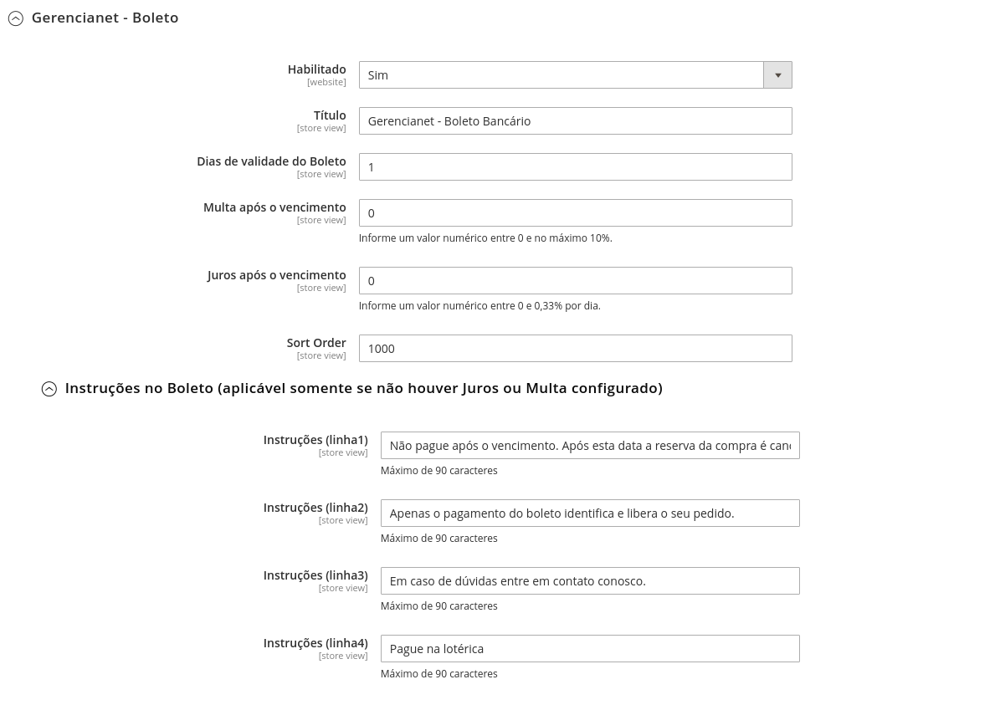

# Gerencianet_Magento2


Módulo de pagamento do Gerencianet, com os métodos de pagamento de Boleto, PIX e Cartão de Crédito.

# Instalação

> Recomendamos que você possua um ambiente de testes para validar as alterações e atualizações antes de atualiar sua loja em produção. Também que seja feito um **backup** com todas as informações antes de executar qualquer procedimento de atualização/instalação.

## Versões Compativeis:
- [x] 2.3.X
- [x] 2.4.0
- [x] 2.4.1
- [x] 2.4.2
 
## Pré requisitos:

- Requer que o PHP esteja no mínimo na versão 7.4.X.
- Requer que o [SDK PHP Gerencianet](https://github.com/gerencianet/gn-api-sdk-php) esteja instalado.

## Instalação do Módulo Gerencianet:

- Realize o download do módulo e siga os seguintes passos de acordo com a forma que sua loja foi instalada:

  #### [Gerencianet_Magento2 ](https://github.com/tezusecommerce/Gerencianet_Magento2)

### Instalar usando o Composer

1. Instale via packagist 
   - ```composer require gerencianet/magento2```
   - Neste momento, podem ser solicitadas suas credenciais de autenticação do Magento. Caso tenha alguma dúvida, há uma descrição de como proceder neste [link da documentação oficial](http://devdocs.magento.com/guides/v2.0/install-gde/prereq/connect-auth.html).
2. Execute os comandos:
   - ```bin/magento setup:upgrade```
   - ```bin/magento setup:di:compile```
   - ```bin/magento cache:clean```
   

   ### Instalar usando o github

- Caso sua loja tenha sido criada por meio do clone ou download do projeto magento, siga os seguintes passos:

  1. Extraia o conteúdo do download ZIP e mova o diretório ```\Magento2\``` para dentro da pasta ```Gerencianet``` ;
  2. Verifique se está dessa maneira seus diretórios na sua loja ```app/code/Gerencianet/Magento2```
  3. Habilite o módulo com o seguinte comando, ```bin/magento module:enable Gerencianet_Magento2```
  4. Instale o SDK PHP do Gerencianet utilizando o seguinte comando ```composer require gerencianet/gerencianet-sdk-php:3.1.0```
  5. Execute o comando ```bin/magento setup:upgrade```
  6. Execute o comando ```bin/magento setup:di:compile```
  7. Execute o comando ```bin/magento cache:clean```
 

# Configurações

Acesse no Painel Administrativo do Magento no menu lateral clique em **Lojas > Configuração > Clientes > Configurações de Cliente > Opções de Nome e Endereço**. Em *Número de Linhas em Endereço* você deve informar o número **4**, conforme imagem abaixo:


Certifique-se também que o campo de telefone esteja obrigatório.

Após realizar a configuração do Cliente, acesse no Painel Administrativo do Magento No menu lateral clique em `Lojas`, na sequencia clique em `Configuração`, no sub-menu `Vendas` clique em `Formas de Pagamento`. Será carregada a tela para configurar os meios de pagamentos do site.


## Como habilitar o Gerencianet

No primeiro bloco de informação, está a configuração para habilitar ou desabilitar o módulo por completo, marque `Sim` para continuar a configuração. 



Campos: 
 - Ambiente: Serve para descrever se as transações 
 - Identificador da Conta: Identificador de Conta do Gerencianet
 - Partner Token: Token do seu parceiro no Gerencianet.
 - Novo Order Status: Serve para após a finalização da compra definir o Status do pedido.
 - Credenciais de Desenvolvimento ou Produção: Aqui você informa as suas credenciais como o Client Id e Client Secret.

Em seguida temos as configurações de cartão de crédito, configurações de boleto e configurações de pix.

OBS: Para que todas as configurações a seguir funcionem, todo o passo a passo anterior deve ter sido seguido.

### Cartão de Crédito 

Nesta sessão você tem as configurações de cartão de crédito.


Campos: 
 - Habilitado: Serve para habilitar ou desabilitar a funcionalidade de cartão de crédito.
 - Título: Altera o nome do método de pagamento no checkout.
 - Sort Order: Ordenação do método de pagamento.

*OBS: Toda configuração de parcelamento, é realizada através do painel do Gerencianet.*

### Pix 

Nesta sessão você tem as configurações de pix.


Campos: 
 - Habilitado: Serve para habilitar ou desabilitar a funcionalidade de cartão de crédito.
 - Título: Altera o nome do método de pagamento no checkout.
 - Dias de validade do Pix: Validade do pix.
 - Certificado Pix: Certificado gerado no painel do Gerencianet
 - Chave Pix: Sua chave pix cadastrada no aplicativo do Gerencianet

### Boleto 

Nesta sessão você tem as configurações de pix.



Campos: 
 - Habilitado: Serve para habilitar ou desabilitar a funcionalidade de cartão de crédito.
 - Título: Altera o nome do método de pagamento no checkout.
 - Dias de validade do Boleto: Validade do Boleto.
 - Multa após o vencimento: Valor da multa a ser cobrada após o vencimento.
 - Juros após o vencimento: Valor de juros a ser cobrado.
 - Sort Order: Ordenação do método de pagamento
 - Instruções no boleto: Aqui você tem quatro campos que podem ser preenchido com mensagens no boleto, desde que as opções de juros e multa estejam zeradas.
